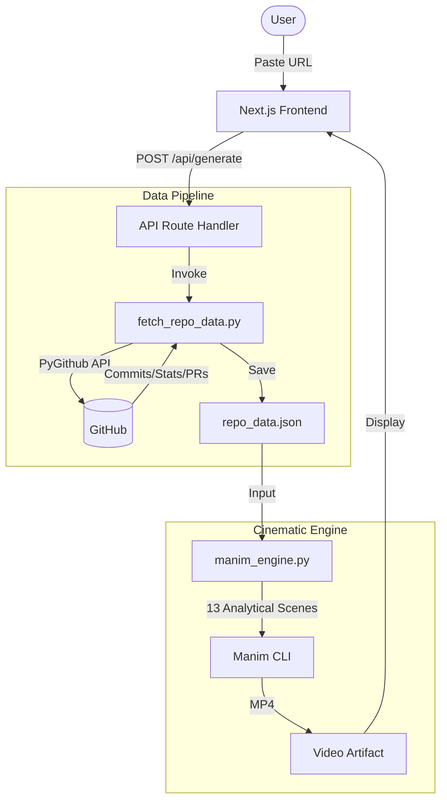
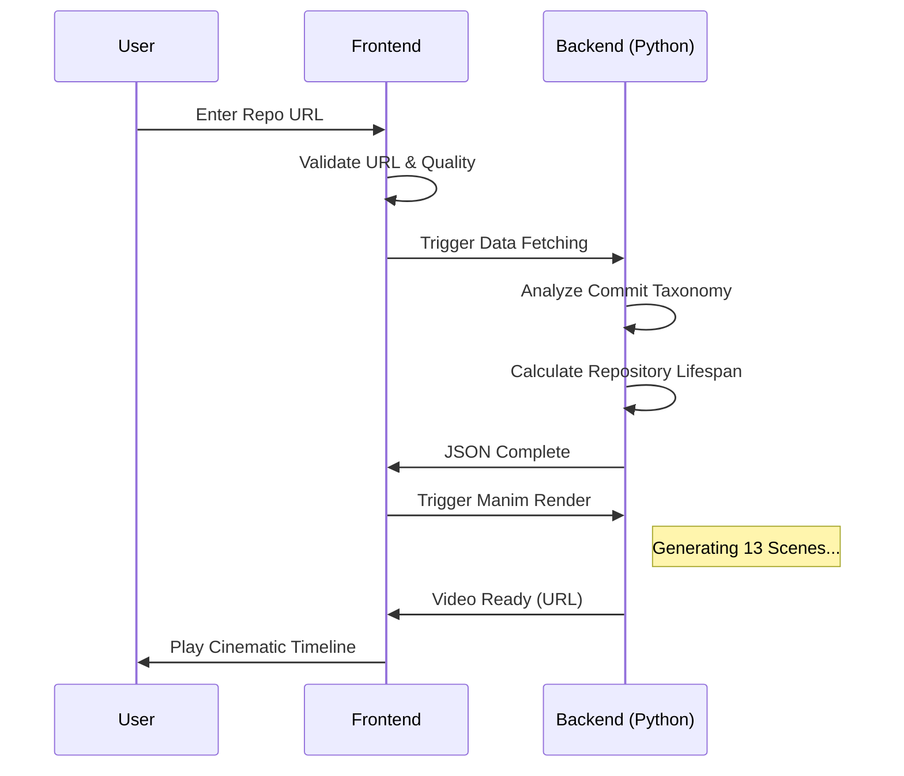

# 🎬 Git Motion

**Transform your GitHub repository into a cinematic technical masterpiece.**  
Git Motion uses the **Manim** mathematical animation engine to generate high-fidelity technical videos from your code's history, contributors, and metadata.

---

## 🛰 System Architecture

The following diagram illustrates how your repository data is transformed into a cinematic story:



---

## 🌊 User Process Flow



---

## 📊 Analytical Scenes (V1.0)

Git Motion renders 13 back-to-back dynamic scenes, including:

1.  **Intro Summary**: Repo name, description, and primary language.
2.  **Pulse Dashboard**: Animated counters for Forks, Issues, and Watchers.
3.  **Language Distribution**: A professional, "exploded" pie chart showing codebase makeup.
4.  **Repository Lifespan**: A premium timeline animation showing the project's age.
5.  **Topic Cloud**: Glassmorphism-style badges for repository topics.
6.  **Activity Feed**: A high-octane slide-out list of the most recent commits.
7.  **PR Health Bar**: Visual breakdown of Merged vs. Open Pull Requests.
8.  **Technical Bar Chart**: Commit taxonomy (Features, Fixes, Docs, etc.).

---

## 🛠 Tech Stack

-   **Frontend**: Next.js 14, TailwindCSS, Framer Motion.
-   **Animation Engine**: [Manim Community](https://www.manim.community/).
-   **API Integration**: PyGithub (GitHub API v3).
-   **Styling**: Premium Dark Mode aesthetics with "Glassmorphism" UI components.

---

## 🚀 Getting Started

### 1. Prerequisites
-   Python 3.10+
-   Manim (and its dependencies: LaTeX, ffmpeg, etc.)
-   GitHub API Token (`GITHUB_TOKEN` in `.env`)

### 2. Installation
```bash
# Clone the repository
git clone https://github.com/your-username/github-to-video.git
cd github-to-video

# Install JS dependencies
npm install

# Install Python dependencies
pip install manim PyGithub matplotlib python-dotenv
```

### 3. Run Development Server
```bash
npm run dev
```

---

## 🎨 Theme System
Git Motion features a robust theme system in `backend/themes.py`. 
-   **`github_dark`**: The signature high-contrast deep blue/black aesthetic.
-   **`dracula`**: A vibrant purple/pink alternative (WIP).

---

## 📜 License
MIT © 2026 Git Motion Team
